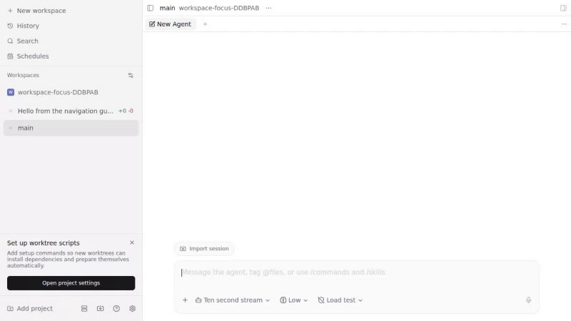
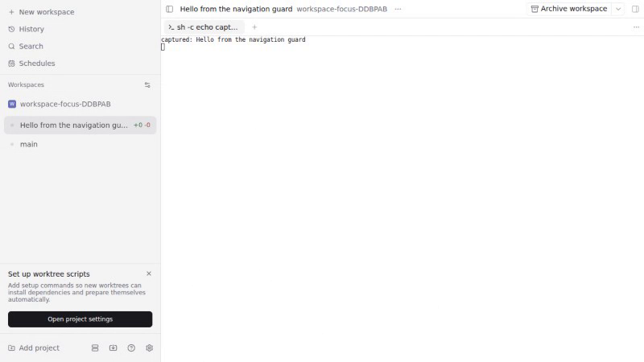

# Workspace creation focus QA

Contribution: Christoph Leiter's [PR #2986](https://github.com/getpaseo/paseo/pull/2986).
Baseline: current main `433e67b18b7964a92d593bdc78c518143accfc8b`.
Verified implementation: `9457bb6f4053b6ab36e7eabcae0a2902176635c8`.

These are recorded Chromium interactions with the real Expo app and isolated Linux daemons.
Workspace registry updates, git worktree creation, uploaded files, and shell terminals are real.
Playwright holds `workspace.create.response` until after the user changes workspace
(or deliberately stays). Recording runs add 1.5 seconds of viewing time.
The agent uses Paseo's built-in simulated provider, model `ten-second-stream`,
mode `load-test`, thinking `low`. This does not verify a live external AI provider.
The simulated provider echoes text only; file preservation is checked at the real
create request and by comparing the uploaded file's bytes, not by expecting its
simulated transcript to echo attachment metadata.

## Before and after

| Journey | Current main | Fix |
| --- | --- | --- |
| Worktree + chat | [Recording](before-worktree-chat.webm) | [Recording](after-worktree-chat.webm) |
| Worktree + terminal | [Recording](before-worktree-terminal.webm) | [Recording](after-worktree-terminal.webm) |
| Empty worktree | [Recording](before-worktree-empty.webm) | [Recording](after-worktree-empty.webm) |
| Local workspace + chat | [Recording](before-local-chat.webm) | [Recording](after-local-chat.webm) |
| Local workspace + terminal | [Recording](before-local-terminal.webm) | [Recording](after-local-terminal.webm) |

The worktree terminal recording shows the chosen `main` workspace remaining active,
then opening the new workspace reveals `captured: Hello from the navigation guard`.
[Preserving a newer draft](after-newer-draft.webm) and
[empty local workspace](after-local-empty.webm) are also recorded.




## Results

- Current-main baseline: both original local journeys fail on the wrong final route.
- Current-main baseline: all three explicit worktree journeys fail on the wrong final route.
- Fix: seven local journeys pass: chat/terminal/empty with leave/stay, plus reopening a newer draft.
- Fix: three explicit worktree journeys pass: chat/terminal/empty with navigation away.
- Revisited workspaces retain exactly one requested agent or terminal; empty workspaces contain neither.
- Chat request retains prompt, provider, model, mode, thinking level, working directory, and uploaded file contents.
- Submitted drafts clear; a newer draft remains intact.
- Focused tests: presence 4, background handoff 5, existing workspace draft-tab tests 5 passed.
- New draft-ownership regression failed before its repair and passed afterward.
- Full typecheck, lint, and format passed.

## Reproduce

From the verified checkout:

```sh
npm install
npm run build:server
npm run build:app-deps
CI=1 E2E_WORKERS=1 E2E_RECORD_VIDEO=1 npm run test:e2e --workspace=@getpaseo/app -- e2e/browser/new-workspace-navigation-guard.spec.ts --retries=0
npm run test --workspace=@getpaseo/app -- src/screens/new-workspace/background-handoff.test.ts src/screens/new-workspace/screen-presence.test.ts src/composer/draft/workspace-tab.test.ts --bail=1
npm run typecheck
npm run lint
npm run format
```

The recorded local run and worktree run were separate focused invocations; the
worktree invocation used `--grep 'worktree '`. Baseline runs used the same
tests with the two modified production entry files restored from the pinned main
commit. Extra helper files are unreachable from that baseline.

Raw command output is in the adjacent `.txt` files. ANSI formatting and local
home/checkout paths have been removed; test results are unchanged.

Tested: Linux Chromium web. Not independently tested: iOS, Android, Electron on
Linux/macOS/Windows, or live external agent providers. No protocol fields changed.
The main developer daemon was not restarted or used for QA.
